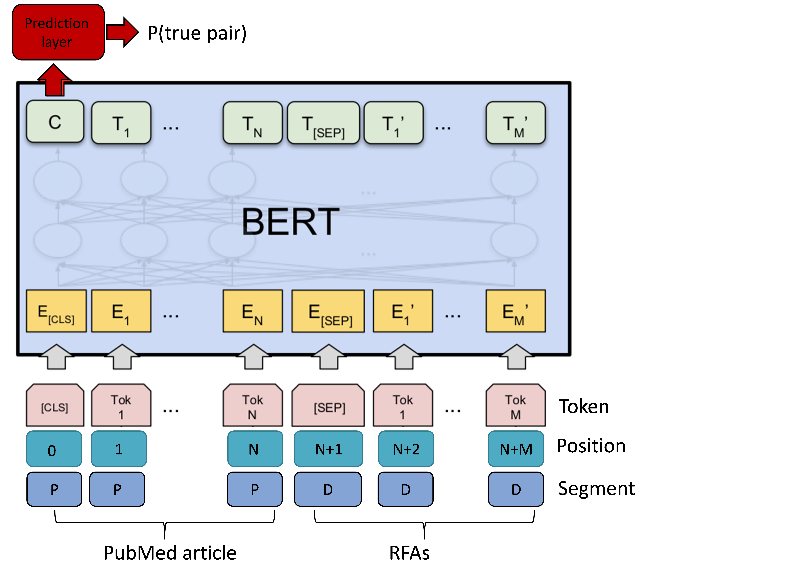
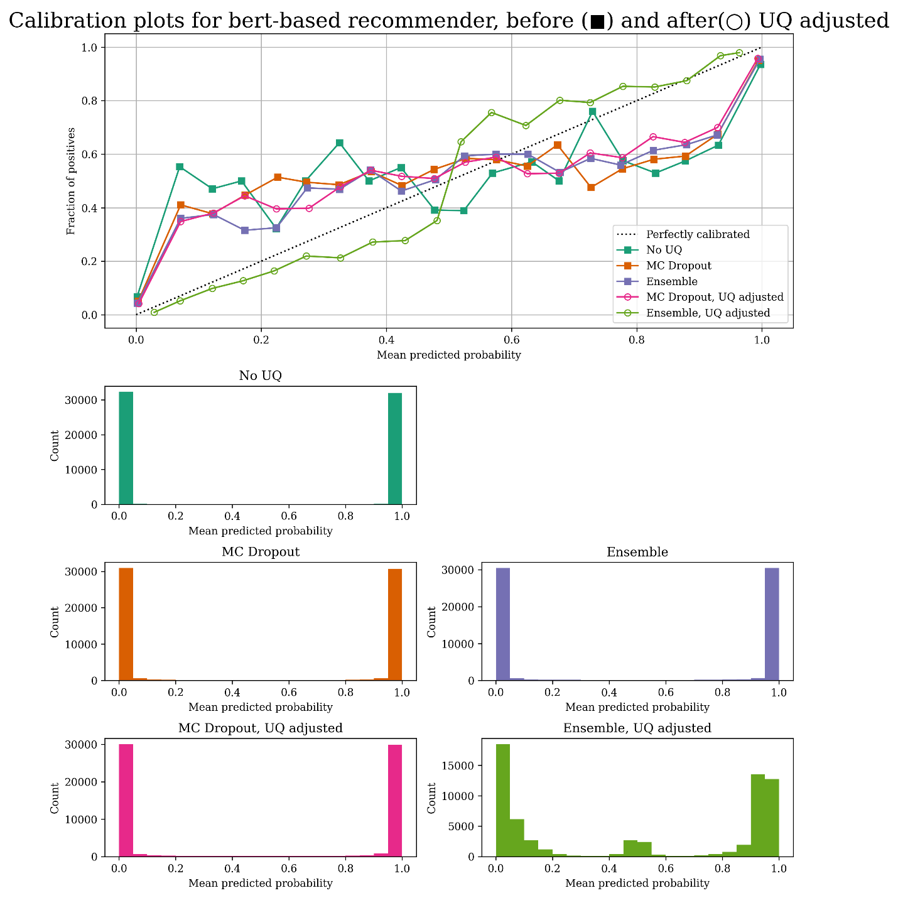
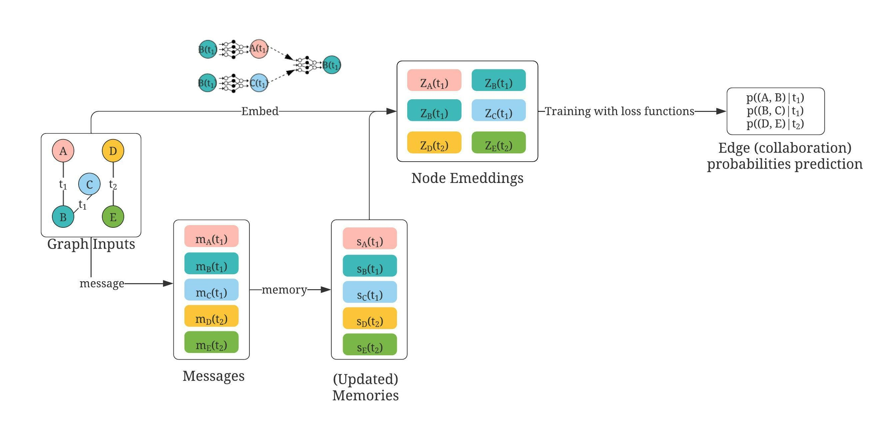
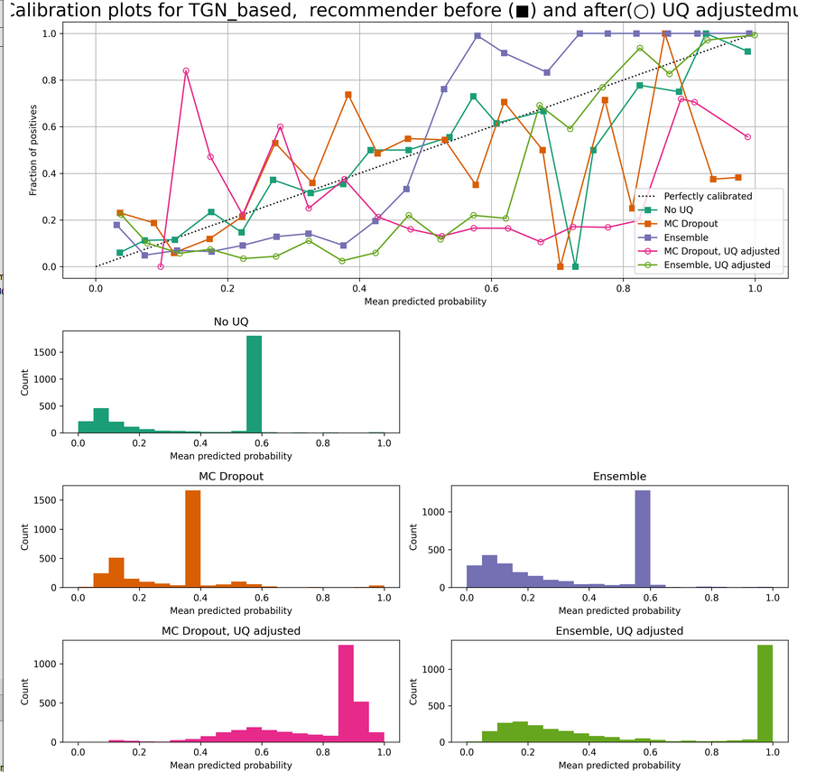

# Virtual Research Assistant (VRA): Uncertainty quantification (UQ) and UQ adjusted results

The ongoing projects of Virtual Research Assistant (VRA), which is a comprehensive research recommendation system providing recommendations regarding datasets, publications, grants and collaborators for scholars of interest in the population health domain.
Developed by researchers from Department of Biostats and Data Science, UTSPH.

**1. Main contributions**:

We introduce uncertainty quantification to our Virtual Research Assistant (VRA) recommender system and propose a new metric to incorporate uncertainty quantification into our recommendations. Initial studies showed that our proposed uncertainty quantification adjustment with ensemble gave the best-calibrated results together with the most desirable recommender performances.

As seen in [Journal]


**2. key snapshots **:

* Part 1: grant & dataset recommender component



* Part 2: collaborator recommender component 





## File organization 

This component is organized as below:
* grantrec:folder containing UQ experiment and adjustments on collaborater rec component, choose between 'regular' for deterministic results, 'MC dropout' or 'Ensemble' for UQ results. Organized similar to corresponding component folder 
    * UQ_grantBERT.ipynb: the main file  
    * utils_TGN.py: the utility file 
    * res: results folder
* collabrec: folder containing UQ experiment and adjustments on collaborater rec component, choose between 'regular' for deterministic results, 'MC dropout' or 'Ensemble' for UQ results. Organized similar to corresponding component folder 
    * UQ_collabTGN.ipynb: the main file 
    * dataset_TGN.py: the data processing file to convert file to pytorch_geometric dataset
    * myTGN.py: the model 
    * utils_TGN.py: the utility file 
    * res: results folder


## Getting Started


### Some simple examples 

Directly using the code from the repo
```
jupyter nbconvert --to notebook --execute UQ_collabTGN.ipynb
```
Or you can easily convert the notebook to a .py file and use the .py file as you do on the command line 
```
$ jupyter nbconvert --to UQ_collabTGN.py UQ_collabTGN.ipynb
python UQ_collabTGN.py ---uqOption 'ensemble' --uqAdjusted 'multiply'
```

## Built With

* [torch](https://pytorch.org/): one of the most commonly used deep learning library  
* [Transformers](https://huggingface.co/transformers/): pytorch library of transformers 
* [pytorch Geometric](https://pytorch-geometric.readthedocs.io/en/latest/): pytorch built for graphs data
* [Pandas](https://pandas.pydata.org/), [numpy](https://numpy.org/), [skearn](https://scikit-learn.org/stable/), and other common machine learning packages, see requirements.txt for details


## Authors

See also the list of [contributors](github.com/ashraf-yaseen/VRA) who participated in this project.

## License

This project is licensed under the MIT License 

## Acknowledgments

* Hat tips 
* Inspiration
* etc

